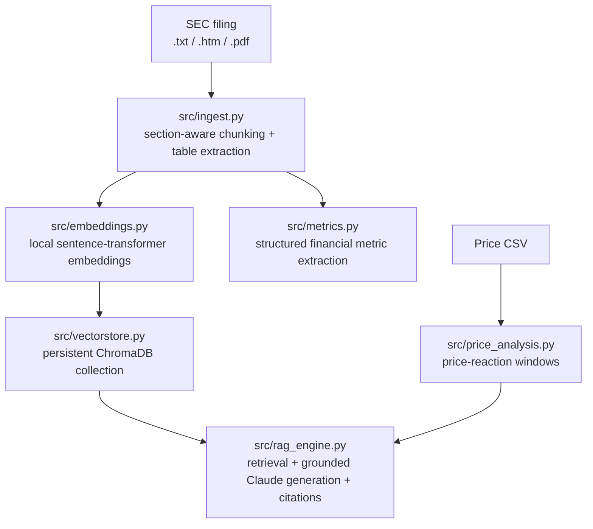

# Financial RAG Copilot

**An equity-research RAG system for SEC 10-K / 10-Q filings and earnings calls** — grounded retrieval with citations, structured financial metric extraction, and a module that links qualitative risk disclosures to real historical stock price reactions.

[](LICENSE)
[](requirements.txt)
[](https://www.anthropic.com)

**[→ Live demo (GitHub Pages)](https://YOUR_USERNAME.github.io/YOUR_REPO/)** — replace with your own link after enabling Pages (see [Deploying the web demo](#deploying-the-web-demo)).

---

### What it does

Point it at a company's 10-K and ask it questions. It retrieves the relevant passages, cites the exact section they came from, and never fabricates a figure it can't find in the source text. It also:

- Extracts structured financial metrics (net sales, gross margin, R&D/SG&A, effective tax rate) straight from the filing's tables
- Links disclosed risks and events to how the stock actually moved afterward, using real price data
- Can search the live web for any company's filing on demand instead of requiring a pre-ingested document

There are two ways to use it, both built from the same core pipeline:

| | Python backend (`cli.py` / `app.py`) | Standalone web app (`docs/index.html`) |
|---|---|---|
| Runs | Locally, any OS | Any browser, including GitHub Pages |
| Vector search | Real embeddings (ChromaDB + sentence-transformers) | Lightweight TF-IDF (no server, no install) |
| Data sources | Upload/ingest any filing | Live web search, PDF/text upload, or bundled sample |
| Best for | Scaling to many filings, offline use, extending the pipeline | Trying it instantly, sharing a link, demos |

---

## Table of contents

- [Quickstart: web demo](#quickstart-web-demo)
- [Quickstart: Python backend](#quickstart-python-backend)
- [Architecture](#architecture)
- [Repository structure](#repository-structure)
- [Deploying the web demo](#deploying-the-web-demo)
- [Security notes](#security-notes)
- [Extending this project](#extending-this-project)
- [Contributing](#contributing)
- [License](#license)

---

## Quickstart: web demo

The fastest way to try it — no install required.

1. Open [`docs/index.html`](docs/index.html) via the [live demo link](#) above, **or** clone this repo and serve it locally:
   ```bash
   git clone https://github.com/YOUR_USERNAME/YOUR_REPO.git
   cd YOUR_REPO
   python3 -m http.server 8000
   # open http://localhost:8000/docs/
   ```
   Opening the file directly by double-clicking it (`file://...`) will break the PDF reader and some browser security rules — always serve it over `http://`.
2. It ships pre-loaded with Apple's real FY2025 10-K. Try the **Ask the Filing** tab immediately, or go to **Upload Data** to search live for a different company, upload your own filing, or load your own price CSV.
3. Paste an [Anthropic API key](https://console.anthropic.com/settings/keys) into the sidebar settings box. This is required for **Ask** and **Live Search** to work when the page isn't running inside Claude.ai (where that call is proxied for you automatically). See [Security notes](#security-notes) before doing this on a publicly hosted copy.

The web app is a single self-contained HTML file — no build step needed to *use* it, only to *regenerate* it (see below).

## Quickstart: Python backend

For real embeddings, bulk ingestion, and offline use.

```bash
git clone https://github.com/python02-hub/financial-RAG-copilot.git
cd YOUR_REPO
python3 -m venv venv && source venv/bin/activate   # Windows: venv\Scripts\activate
pip install -r requirements.txt

cp .env.example .env   # add your ANTHROPIC_API_KEY
```

```bash
# Ingest the bundled real Apple 10-K
python cli.py ingest --file data/filings/AAPL_10K_FY2025.txt \
    --company AAPL --filing-type 10-K --fiscal-year 2025

# Ask a grounded question — cites the exact 10-K section
python cli.py ask "What did Apple say about tariff risk and its supply chain?" --company AAPL

# See the most interesting real result: price reaction to the iPhone 17 launch
python cli.py known-events --csv data/prices/AAPL_prices.csv
```

Or launch the full dashboard:

```bash
streamlit run app.py
```

Full CLI reference and ingestion details are in [`app.py`](app.py)/[`cli.py`](cli.py) docstrings.

---

## Architecture



The standalone web app (`web/template.html` → `docs/index.html`) mirrors this pipeline in JavaScript: TF-IDF retrieval in place of embeddings, the same section-detection regex, and the same Claude call pattern for generation — so results stay conceptually consistent between the two interfaces even though one runs server-side and one runs entirely in a browser.

## Repository structure

```
.
├── cli.py                  # Command-line interface (ingest / ask / metrics / price-reaction)
├── app.py                  # Streamlit dashboard
├── requirements.txt
├── .env.example
├── src/
│   ├── ingest.py            # Section-aware chunking + table extraction (.txt/.htm/.pdf)
│   ├── embeddings.py        # Local sentence-transformer embeddings
│   ├── vectorstore.py       # ChromaDB persistent collection wrapper
│   ├── rag_engine.py        # Retrieval + grounded Claude generation
│   ├── metrics.py           # Structured financial metric extraction
│   └── price_analysis.py    # Disclosure → stock price reaction linking
├── data/
│   ├── filings/              # Bundled real sample: Apple FY2025 10-K (SEC EDGAR)
│   └── prices/                # Bundled real sample: AAPL daily OHLC
├── web/
│   ├── template.html         # Source template for the standalone web app
│   └── build.py              # Regenerates docs/index.html from data/ + template.html
├── docs/
│   └── index.html             # Built standalone web app — this is what GitHub Pages serves
└── .github/workflows/ci.yml   # Syntax checks + reproducible-build check
```

**Only edit `web/template.html`, never `docs/index.html` directly** — the latter is a generated build artifact. After editing the template or the bundled sample data, regenerate it:

```bash
python web/build.py
```

## Deploying the web demo

1. Push this repo to GitHub.
2. Go to **Settings → Pages**.
3. Under **Build and deployment**, set **Source** to `Deploy from a branch`, branch `main`, folder `/docs`.
4. Your live demo will be at `https://YOUR_USERNAME.github.io/YOUR_REPO/` within a minute or two.
5. Update the live-demo link at the top of this README.

## Security notes

The web demo calls the Anthropic API directly from the browser. Two things follow from that:

- **Inside a Claude.ai artifact**, that call is proxied automatically — visitors need no key.
- **On GitHub Pages (or anywhere else outside Claude.ai)**, each visitor must supply their own API key, pasted into the sidebar. It's stored only in that visitor's browser (`localStorage`) and sent directly from their browser to Anthropic — **it never touches this repo, a server you control, or anyone else's browser.**

That said, any key typed into a page like this is visible to that browser's own dev tools/network tab — which is fine for personal use, but **don't ever commit a real key to this repo**, and don't be surprised if people are cautious about pasting a key into a public demo page they don't control. For a production deployment serving other people, proxy the Anthropic API call through your own backend instead of calling it directly from the browser.

## Extending this project

- Swap the embedding model (`src/embeddings.py`) for a larger one if retrieval quality on bigger filing sets needs improvement.
- Add more companies/years: drop filings into `data/filings/`, ingest via `cli.py`, and the Streamlit/CLI tools pick them up automatically.
- The live web-search feature (`Upload Data` tab in the web app) is prompted to never fabricate a financial figure — see the `LIVE_FILING_SYSTEM` prompt in `web/template.html` if you want to tighten or loosen that behavior.
- Swap ChromaDB for Pinecone/Weaviate in `src/vectorstore.py` if you need multi-user concurrent access instead of a local file store.

## Contributing

Contributions are welcome — see [CONTRIBUTING.md](CONTRIBUTING.md).

## License

[MIT](LICENSE) — use it, fork it, ship it.

---

*Built as a demonstration of RAG over financial documents: real SEC EDGAR data, real price data, no fabricated figures. Not investment advice.*
